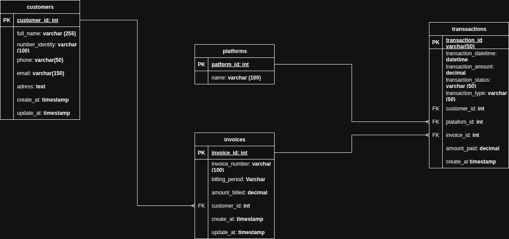

# Customer, Invoice & Transaction Management System

## System Description

This system is a web application designed to manage customers, invoices, and transactions efficiently. It allows users to create, edit, delete, and view customer records, as well as manage related invoices and transactions. The system supports bulk data import from CSV files and provides advanced queries for business insights.

---

## Technologies Used

- **Frontend:** HTML, CSS, JavaScript, Bootstrap
- **Backend:** Node.js, Express.js
- **Database:** MySQL
- **Other:** dotenv, nodemon, express-validator, Postman (for API testing)

---

## How to Run the Project

1. **Clone the repository**
   ```bash
   git clone https://github.com/s4mue3l2005/prueba-de-desempe-o-M4.git
   cd prueba_desempeño_M4S4
   ```

2. **Install dependencies**
   ```bash
   npm install
   ```

3. **Configure environment variables**
   - Create a `.env` file in the root directory with:
     ```
     DB_HOST=localhost
     DB_USER=your_user
     DB_PASSWORD=your_password
     DB_NAME=your_database
     PORT=3000
     ```

4. **Set up the database**
   - Create the database and tables in MySQL according to the relational model (see below).
   - (Optional) Place your CSV file in `server/data/data.csv` for bulk import.

5. **Start the server**
   ```bash
   npm run dev
   ```

6. **Access the application**
   - Open your browser at [http://localhost:3000](http://localhost:3000)

---

## Normalization Explanation

The database is normalized to **Third Normal Form (3NF)** to ensure data integrity and avoid redundancy:

- **Customers Table:** Stores unique customer information.
- **Invoices Table:** Each invoice references a customer via a foreign key.
- **Transactions Table:** Each transaction references an invoice and a customer, ensuring all relationships are explicit and non-redundant.
- **Platforms Table:** Used for transaction platform normalization.

This structure prevents duplicate data and maintains referential integrity across all entities.

---

## Bulk Data Import from CSV

To perform a bulk import:

1. Place your CSV file in `server/data/data.csv`.
2. Start the server.
3. The backend will process the CSV and populate the database with customers, invoices, and transactions.

If any error occurs, check the server console for details.

---

## Advanced Queries Explanation

The system provides advanced queries accessible via Postman:

- **Total Paid by Each Customer:**  
  `GET /api/reports/total_paid_by_customer`  
  Returns the total amount paid by each customer.

- **Pending Invoices with Client and Last Transaction Info:**  
  `GET /api/reports/pending_invoices`  
  Lists all pending invoices, including customer and last transaction details.

- **List Transactions by Platform:**  
  `GET /api/reports/transactions_by_platform/:platform`  
  Returns all transactions filtered by the specified platform.

Import the provided Postman collection from the `postman/` folder to test these endpoints.

---

## Relational Model Diagram

Below is a simplified representation of the relational model:



- **customers**: Main entity for client data.
- **invoices**: Linked to customers.
- **transactions**: Linked to invoices, customers, and platforms.
- **platforms**: Reference for transaction platforms.

---

## Developer Information

- **Name:** Samuel Arena
- **Clan:** caimán
- **Email:** samyarena2005@gmail.com